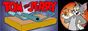

<!---
✨ special ✨ 

git images in this file was taken from <:https://github.com/sindresorhus/sindresorhus
--->

# Hi, I’m wishwa. 👋  
  
👨🏽‍🍳 React, Flutter and Go  📍 southside, Sri lanka
 

:shipit: [wishwa.dev](https://www.wishwa.dev/)
 
 

# 💻 Tech Stack:
  

  

    
    
    
    
    
    
    
    
    
    
    
    
    
    
    
    
    
    
    
    
    
    
    
    
    
    
    
    
    
    
    
    
    
    
    
    
    
    
    
    
    
    
    
    
    
    
    
    
    
    
    
    
    
    
  

  
  

## Icons from : [devicon.dev](https://devicon.dev/)
## Gifs from  : [cyber.dabamos.de/88x31](https://cyber.dabamos.de/88x31/index.html)

   

  

                
  

   

 

  [wishwa.dev](https://www.wishwa.dev/)

